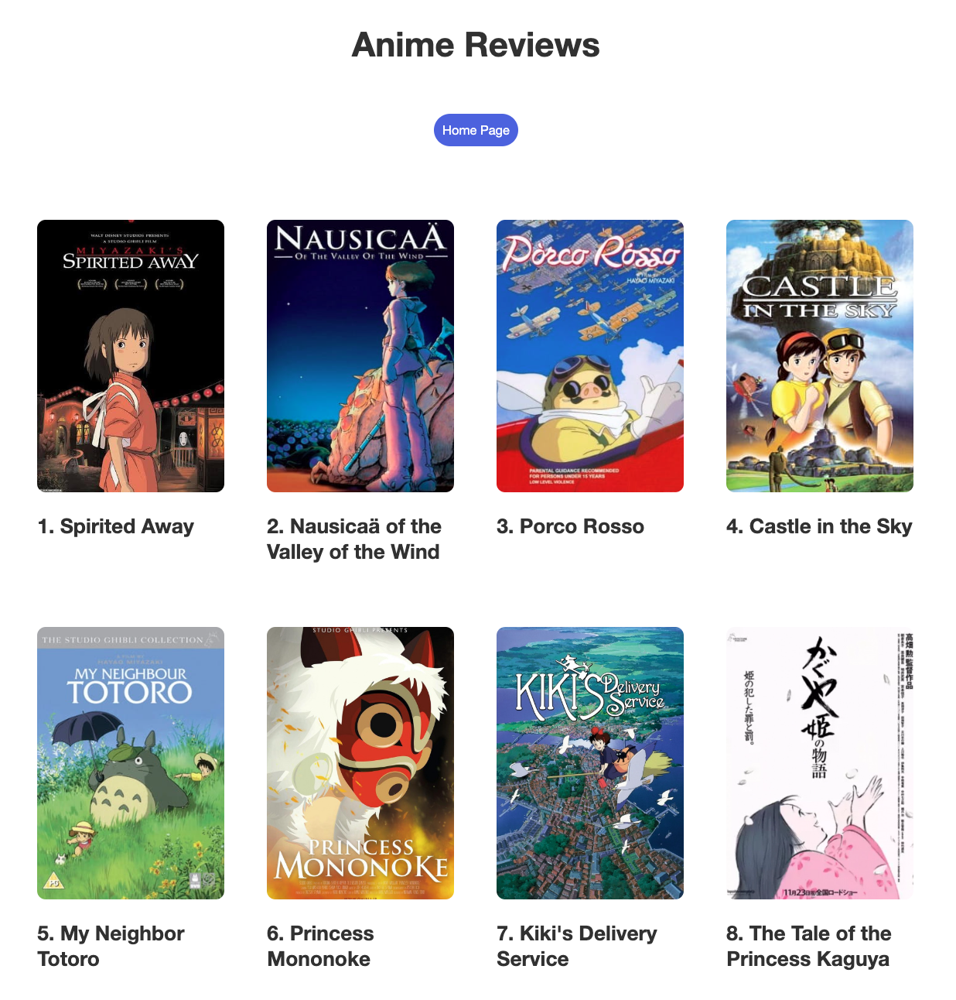
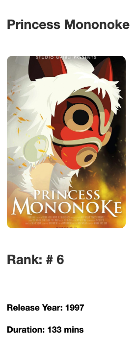
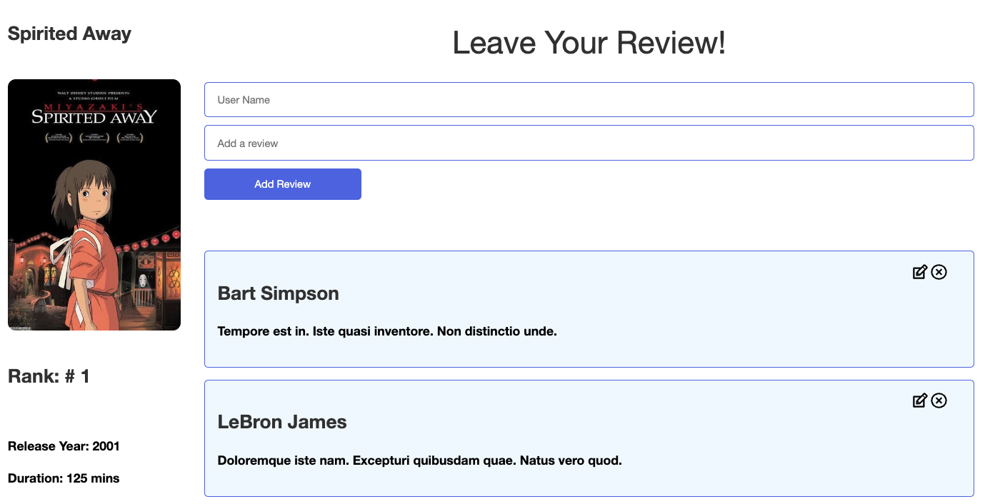

# Studio Ghibli Anime Review! 

## Overview

Studio Ghibli is a world renowned Japanese animation studio best kwown for their beautiful and moving animated feature films. Founded in 1985, this legendary studio has over 20 animated films included in their catalog and has recieved 5 Academy Award nominations. But don't take our word for it, check out what other viewers have to say! 

## Features and How to Use

* Access a catalog spanning over 35 years! 

* Check out some fun facts about your favorite Studio Ghibli film!

* Leave a review!

### Requirements 
* Functional Web Browser

### Installation Instructions 
* Fork and clone

# In your terminal:
* Run bundle install
* Run npm install --prefix client
* Run shotgun
* In another terminal run npm start --prefix phase-3-project-client 
* Enjoy! Happy Reviewing! 